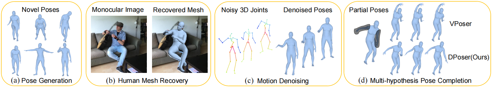

# 🌟 DPoser: Diffusion Model as Robust 3D Human Pose Prior 🌟

### [🔗 Project Page](https://dposer.github.io/) | [🎥 Video](https://youtu.be/tbi8nwTaV3M) | [📄 Paper](https://arxiv.org/abs/2312.05541)
#### Authors
[Junzhe Lu](https://scholar.google.com/citations?user=hnJ4NIYAAAAJ), [Jing Lin](https://jinglin7.github.io), [Hongkun Dou](https://scholar.google.com/citations?user=pSNEkEwAAAAJ), [Ailing Zeng](https://ailingzeng.site/), [Yue Deng](https://shi.buaa.edu.cn/yuedeng/en/index.htm), [Yulun Zhang](https://yulunzhang.com/), [Haoqian Wang](https://www.sigs.tsinghua.edu.cn/whq_en/main.htm)  

<p align="center">

<br>
<em>📊 An overview of DPoser’s versatility and performance across multiple pose-related tasks</em>
</p>

## 📘 1. Introduction  

Welcome to the official implementation of *DPoser: Diffusion Model as Robust 3D Human Pose Prior.* 🚀  
In this repository, we're excited to introduce DPoser, a robust 3D human pose prior leveraging diffusion models. DPoser is designed to enhance various pose-centric applications like human mesh recovery, pose completion, and motion denoising. Let's dive in!

## 🔄 **Switch to the 'v2' Branch for Enhanced Features!**

We highly recommend switching to the 'v2' branch, which supports additional pose priors and features cleaner, more structured code. To switch, use the following command:

```bash
git checkout v2
```

## 🛠️ 2. Setup Your Environment 

- **Tested Configuration**: Our code works great on PyTorch 1.12.1 with CUDA 11.3.

- **Installation Recommendation**:
  ```shell
  conda install pytorch==1.12.1 torchvision==0.13.1 cudatoolkit=11.3 -c pytorch
  ```
- **Required Python Packages**:
  ```shell
  pip install requirements.txt
  ```
- **Body Models**:
We use the [SMPLX](https://smpl-x.is.tue.mpg.de/) body model in our experiments. Make sure to set the `--bodymodel-path` parameter correctly in scripts like `./run/demo.py` and `./run/train.py` based on your body model's download location.

## 🚀 3. Quick Demo

* **Pre-trained Model**: Grab the pre-trained DPoser model from [here](https://drive.google.com/drive/folders/1kJhWZ6m7lWkK9W--gZPa7ibAOAec4ei2?usp=drive_link) and place it in `./pretrained_models`.

* **Sample Data**: Check out `./examples` for some sample files, including 500 body poses from the AMASS dataset and a motion sequence fragment.

* **Explore DPoser Tasks**:

### 🎭 Pose Generation
Generate poses and save rendered images:
  ```shell
  python -m run.tester.body.demo --config configs/body/subvp/timefc.py  --task generation
  ```
For videos of the generation process:
  ```shell
  python -m run.tester.body.demo --config configs/body/subvp/timefc.py  --task generation_process
  ```

### 🧩 Pose Completion
Complete poses and view results:
  ```shell
  python -m run.tester.body.demo --config configs/body/subvp/timefc.py  --task completion --hypo 10 --part right_arm --view right_half
  ```
Explore other solvers like [ScoreSDE](https://github.com/yang-song/score_sde_pytorch) for our DPoser prior:
  ```shell
  python -m run.tester.body.demo --config configs/body/subvp/timefc.py  --task completion --mode ScoreSDE --hypo 10 --part right_arm --view right_half
  ```

### 🌪️ Motion Denoising
Summarize visual results in a video:
  ```shell
  python -m run.tester.body.motion_denoising --config configs/body/subvp/timefc.py --file-path ./examples/Gestures_3_poses_batch005.npz --noise-std 0.04
  ```

### 🕺 Human Mesh Recovery
Use the detected 2D keypoints from [ViTPose](https://github.com/ViTAE-Transformer/ViTPose) and save fitting results:
  ```shell
  python -m run.tester.body.demo_fit --img ./examples/body/images/01_img.jpg --kpt_path ./examples/body/predictions/01_img.json
  ```


## 🧑‍🔬 4. Train DPoser Yourself
### Dataset Preparation
To train DPoser, we use the [AMASS](https://amass.is.tue.mpg.de/) dataset. You have two options for dataset preparation:

- **Option 1: Process the Dataset Yourself**  
  Download the AMASS dataset and process it using the following script:
  ```shell
  python -m lib/data/script.py
  ```
  Ensure you follow this directory structure:
  ```
  ${ROOT}  
  |-- data  
  |  |-- AMASS  
  |     |-- amass_processed  
  |        |-- version1  
  |           |-- test  
  |              |-- betas.pt  
  |              |-- pose_body.pt  
  |              |-- root_orient.pt  
  |           |-- train  
  |           |-- valid  
  ```

- **Option 2: Use Preprocessed Data**  
  Alternatively, download the processed data directly from [Google Drive](https://drive.google.com/file/d/1TQi_wKxJU3TTcVko-oPlWvp8L12lNR7F/view?usp=sharing).

### 🏋️‍♂️ Start Training
After setting up your dataset, begin training DPoser:
  ```shell
  python -m run.trainer.body.diffusion --config configs/body/subvp/timefc.py --name reproduce
  ```
This command will start the training process. The checkpoints and TensorBoard logs will be stored under `./checkpoints` and `./logs` separately.

## 🧪 5. Test DPoser

### Pose Generation
Quantitatively evaluate the generated samples using this script:
  ```shell
  python -m run.tester.body.demo --config configs/body/subvp/timefc.py --task eval_generation
  ```
This will use the [SMPL](https://smpl.is.tue.mpg.de/) body model to evaluate APD and SI for 500 samples following [Pose-NDF](https://github.com/garvita-tiwari/PoseNDF).
Additionally, we evaluate the common metrics like [FID](https://github.com/mseitzer/pytorch-fid), [Precision, Recall](https://github.com/kynkaat/improved-precision-and-recall-metric) for 50000 samples.

### Pose Completion
For testing on the AMASS dataset (make sure you've completed the dataset preparation in Step 4):
  ```shell
  python -m run.tester.body.completion --config configs/body/subvp/timefc.py --gpus 1 --hypo 10 --sample 10 --part legs
  ```

### Motion Denoising
To evaluate motion denoising on the AMASS dataset, use the following steps:

- Split the `HumanEva` part of the AMASS dataset into fragments using this script:
  ```shell
  python lib/data/body_process/HumanEva.py --input-dir path_to_HumanEva --output-dir ./data/HumanEva_60frame  --seq-len 60
  ```
- Then, run this script to evaluate the motion denoising task on all sub-sequences in the `data-dir`:
  ```shell
  python -m run.tester.body.motion_denoising --config configs/body/subvp/timefc.py --data-dir ./data/HumanEva_60frame --noise-std 0.04
  ```
- Alternatively, run the denoising task with partial visible joints:
  ```shell
  python -m run.tester.body.motion_denoising_partial --config configs/body/subvp/timefc.py --data-dir ./data/HumanEva_60frame --part left_arm
  ```  
  
### Human Mesh Recovery
To test on the EHF dataset, follow these steps:

- First, download the EHF dataset from [SMPLX](https://smpl-x.is.tue.mpg.de/).
- Next, detect the 2d keypoints using [ViTPose](https://github.com/ViTAE-Transformer/ViTPose).
  Ensure you follow this directory structure:
  ```
  ${EHF_ROOT}
  .
  |-- 01_align.ply
  |-- 01_img.jpg
  |-- 01_img.png
  |-- 01_scan.obj
  ...
  |-- vitpose_keypoints
      |-- predictions
            |-- 01_img.json
            |-- 02_img.json
            ...
    ```
  
- Specify the `--data-dir` and run this script:
  ```shell
  python -m run.tester.body.EHF --data_dir=path_to_EHF --outdir=./lifting_results --prior DPoser --kpts vitpose
  ```

## 📊 Implementation of other pose priors
- You can explore other pose priors like [GMM](https://github.com/githubcrj/simplify), [VPoser](https://github.com/nghorbani/human_body_prior), [PoseNDF](https://github.com/garvita-tiwari/PoseNDF), [GAN-S](https://github.com/cvlab-epfl/adv_param_pose_prior) in our repo.
  
  We have provided the implementation of them in the `other_priors` folder for tasks like pose generation, completion, human mesh recovery and motion denoising.
  Note that you should download the pre-trained models from the original repositories first. (For GAN-S, you may need to train the model yourself.)

- For human mesh recovery, you can directly set the `--prior` parameter to one of `'DPoser', 'VPoser', 'GMM', 'Posendf', 'None'` in the `run.tester.body.demo_fit` and `run.tester.body.EHF` scripts.

## ❓ Troubleshoots

- `RuntimeError: Subtraction, the '-' operator, with a bool tensor is not supported. If you are trying to invert a mask, use the '~' or 'logical_not()' operator instead.`: [Solution here](https://github.com/mks0601/I2L-MeshNet_RELEASE/issues/6#issuecomment-675152527)

- `TypeError: startswith first arg must be bytes or a tuple of bytes, not str.`: [Fix here](https://github.com/mcfletch/pyopengl/issues/27). 

## 🙏 Acknowledgement
Big thanks to [ScoreSDE](https://github.com/yang-song/score_sde_pytorch), [GFPose](https://github.com/Embracing/GFPose), and [Hand4Whole](https://github.com/mks0601/Hand4Whole_RELEASE) for their foundational work and code.

## 📚 Reference  

```
@article{lu2023dposer,
  title={DPoser: Diffusion Model as Robust 3D Human Pose Prior},
  author={Lu, Junzhe and Lin, Jing and Dou, Hongkun and Zeng, Ailing and Deng, Yue and Zhang, Yulun and Wang, Haoqian},
  journal={arXiv preprint arXiv:2312.05541},
  year={2023}
}
```
